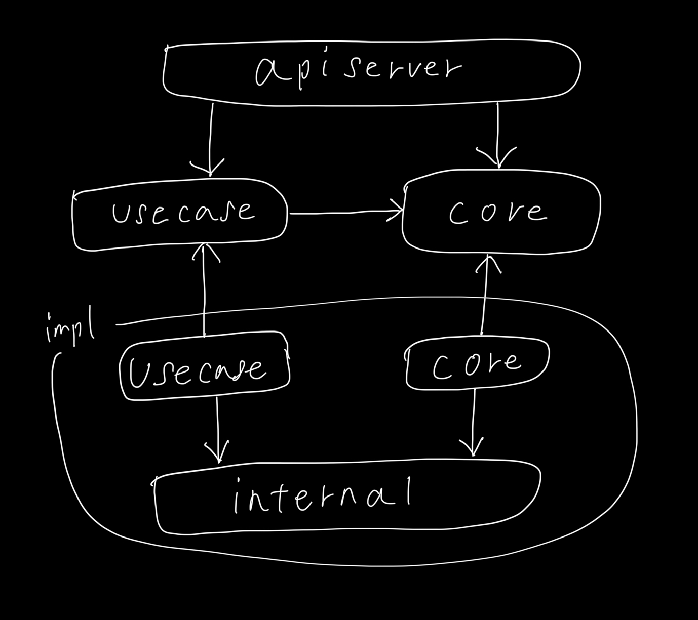

# Lexicorn Backend

Web application: [Lexicorn](https://lexicorn.vercel.app/)

## Architecture overview (pkg/)

`core`: Define the interface of the fundamental logics and structs of the application. Logics that are not complex nor depends on external services can be written here too.

`usecase`: Logics that are specific to a particular application purpose or processes requiring inter-core logic are written here. Applications that can be written using `core` alone don't necessarily require the use of `usecase`.

Generally, we write `usecase` by combining `core` logic. However, when we need to write logics that are complex or depend on external services but don't exist in the `core` layer and is required only in the `usecase` layer, we define its interfaces only and implement that part in the `impl` layer.

`impl`: Implementation of the interfaces defined in `core` and `usecase`.

`util`: Utility modules that any layers can depend on.

`apiserver`: REST-like api server. Parse client's request and call appropriate logics from `core` and `usecase`.

